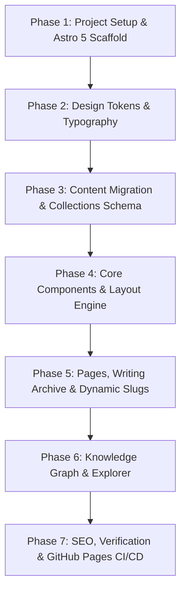

# Website Redesign & Migration Blueprint: Jekyll to Astro (sjarmak.ai Style)

> **Document Status**: Complete Technical Specification & Implementation Guide  
> **Target Audience**: Future AI pair-programming agents & human developers  
> **Source Inspiration**: [`sjarmak/website`](https://github.com/sjarmak/website) ([sjarmak.ai](https://www.sjarmak.ai/))  
> **Current Repository**: `karim-bhalwani.github.io`  
> **Primary Goal**: Transform Karim Bhalwani's AI Systems Engineering blog into an editorial, archival research atlas with dark mode, modern typography, typed content collections, and an interactive knowledge graph.

---

## 1. Executive Summary & Vision

### Current State (`karim-bhalwani.github.io`)
- **Engine**: Jekyll (Ruby / Kramdown / Rouge).
- **Content**: 18 in-depth, original technical essays on AI Systems Engineering, Coding Agents, Harness Architecture, Verifiers, and Token Economics.
- **Design**: Default basic light theme with minimal typography, no dark mode, simple linear post listing, and standard CSS styling.
- **Assets**: Rich bespoke diagrams and hero illustrations organized under `/assets/<post-slug>/`.

### Target State (Inspired by `sjarmak.ai`)
- **Engine**: **Astro 5** (SSG, TypeScript, Content Layer with Zod schemas, zero client-side JavaScript by default).
- **Aesthetic**: **"Warm Archival Atlas" / Editorial System Studio**:
  - **Light Mode ("Paper")**: Tactile warm parchment neutrals, deep warm ink typography, glowing ember accents, sage tags.
  - **Dark Mode ("Viewing Room")**: Deep warm charcoal/slate background (`oklch(20% 0.012 70)`), glowing amber/ember interactive highlights, high contrast without harsh pure black/white.
- **Typography**: Dual variable font pairing:
  - **Headings & Display**: `Literata` (warm, literary editorial serif).
  - **Body & Interface**: `Hanken Grotesk` (clean, humanist sans-serif).
  - **Code & Monospace**: `JetBrains Mono` / `SFMono-Regular`.
- **Knowledge Architecture**:
  - Content Collections (`posts`, `topics`, `projects`, `cv`).
  - **Interactive Topic & Graph Explorer** (Canvas/D3 visualization connecting essays, topics like *Harness Architecture*, *Verifiers & RLVR*, *Agent Fleets*, and architectural artifacts).
  - Preserved URLs & media links for seamless SEO transition on GitHub Pages.

---

## 2. In-Depth Comparative Analysis

| Dimension | Current Jekyll Site | Inspiration (`sjarmak.ai` / Astro) | Proposed Target for Karim's Site |
| :--- | :--- | :--- | :--- |
| **Framework** | Jekyll (Ruby 3, Gemfile) | Astro v5.18+ (Node 22+, TS, ESM) | **Astro 5 + TypeScript + Vite** |
| **Theme / Modes** | Light only (browser defaults) | Light ("Paper") & Dark ("Viewing Room") via CSS custom properties + non-blocking script | **Dual-theme OKLCH color token system with instant toggle** |
| **Design Language** | Minimalist standard blog | Curated "Warm Archival Atlas", bespoke layout utilities (`stack`, `cluster`, `auto-grid`) | **Warm Archival Studio / AI Systems Architecture Lab** |
| **Typography** | Default browser sans-serif | Self-hosted `Literata` (Serif) + `Hanken Grotesk` (Sans) | **Self-hosted Variable `Literata` + `Hanken Grotesk` + `JetBrains Mono`** |
| **Content Schema** | Flat Markdown + basic YAML frontmatter | Astro Content Collections with typed Zod schemas, bidirectional references | **Typed Content Collections for Essays, Topics, Case Studies / Projects, and CV** |
| **Interactivity** | None (Static HTML links) | Interactive Canvas/D3 MiniGraph and Full Graph Explorer (`/projects/explorer`) | **Topic & Essay Knowledge Graph Explorer** |
| **Code Formatting** | Rouge syntax highlighter | Shiki (built into Astro) with matching theme tokens | **Shiki syntax highlighter with custom warm dark/light theme** |
| **Deployment** | GitHub Pages (standard Jekyll build) | Render / Cloudflare / GitHub Actions | **GitHub Actions static build deployed to GitHub Pages** |

---

## 3. Design System & Token Architecture

The design uses **OKLCH color primitives** to avoid muddy grays, pure `#000000`, or glaring `#ffffff`.

### 3.1 OKLCH Color Primitives & Semantics

```css
/* src/styles/tokens.css */
:root {
  /* --- Primitive Ramps --- */
  /* Warm Paper Neutrals (Hue ~80-85) */
  --paper-50:  oklch(98.5% 0.008 85);
  --paper-100: oklch(96.5% 0.012 83); /* Light background */
  --paper-200: oklch(93.5% 0.014 82); /* Raised card surface */
  --paper-300: oklch(88.0% 0.016 80); /* Hairlines & borders */
  --paper-400: oklch(80.0% 0.018 78);

  /* Deep Warm Ink Neutrals */
  --ink-900: oklch(23.0% 0.020 60);  /* Primary text (light) */
  --ink-700: oklch(38.0% 0.018 62);  /* Secondary text */
  --ink-500: oklch(52.0% 0.015 64);  /* Muted metadata */

  /* Ember / Terracotta Accent (System Highlight) */
  --ember-300: oklch(82.0% 0.100 60); /* Selection / Glow */
  --ember-500: oklch(60.0% 0.160 52); /* Primary Accent & Links */
  --ember-600: oklch(53.0% 0.165 48); /* Hover state */

  /* Sage / Emerald (Verification / Success / Tags) */
  --sage-500: oklch(62.0% 0.050 150);
  --sage-600: oklch(48.0% 0.060 150);

  /* Dark Viewing Room Neutrals (Warm Charcoal / Slate) */
  --night-950: oklch(16.0% 0.010 70); /* Dark canvas floor */
  --night-900: oklch(20.0% 0.012 70); /* Dark page background */
  --night-800: oklch(24.0% 0.013 72); /* Dark card surface */
  --night-700: oklch(31.0% 0.014 72); /* Dark border */
  --night-text: oklch(88.0% 0.010 80); /* Dark primary text */
  --night-muted: oklch(65.0% 0.012 75);/* Dark secondary text */

  /* --- Semantic Tokens (Default Light) --- */
  --color-bg: var(--paper-100);
  --color-surface: var(--paper-200);
  --color-border: var(--paper-300);
  --color-text: var(--ink-900);
  --color-text-muted: var(--ink-500);
  --color-accent: var(--ember-500);
  --color-accent-hover: var(--ember-600);
  --color-selection: var(--ember-300);

  /* --- Spacing & Fluid Scale --- */
  --space-3xs: clamp(0.25rem, 0.23vw + 0.2rem, 0.38rem);
  --space-2xs: clamp(0.5rem, 0.45vw + 0.4rem, 0.75rem);
  --space-xs:  clamp(0.75rem, 0.68vw + 0.6rem, 1.13rem);
  --space-s:   clamp(1.0rem, 0.91vw + 0.8rem, 1.5rem);
  --space-m:   clamp(1.5rem, 1.36vw + 1.2rem, 2.25rem);
  --space-l:   clamp(2.0rem, 1.82vw + 1.6rem, 3.0rem);
  --space-xl:  clamp(3.0rem, 2.73vw + 2.4rem, 4.5rem);

  /* --- Typography Families --- */
  --font-display: "Literata", Georgia, serif;
  --font-body: "Hanken Grotesk", -apple-system, BlinkMacSystemFont, "Segoe UI", sans-serif;
  --font-mono: "JetBrains Mono", ui-monospace, SFMono-Regular, Menlo, monospace;
}

[data-theme="dark"] {
  --color-bg: var(--night-900);
  --color-surface: var(--night-800);
  --color-border: var(--night-700);
  --color-text: var(--night-text);
  --color-text-muted: var(--night-muted);
  --color-accent: var(--ember-300);
  --color-accent-hover: var(--ember-500);
  --color-selection: oklch(35% 0.08 52);
}
```

### 3.2 Non-Blocking Theme Toggle Execution

To eliminate theme flash on page reload:
```html
<!-- src/components/nav/ThemeScript.astro -->
<script is:inline>
  (function () {
    try {
      var saved = localStorage.getItem("theme");
      var prefersDark = window.matchMedia("(prefers-color-scheme: dark)").matches;
      var theme = saved ? saved : prefersDark ? "dark" : "light";
      document.documentElement.dataset.theme = theme;
    } catch (e) {
      document.documentElement.dataset.theme = "dark";
    }
  })();
</script>
```

---

## 4. Content Architecture & Schema Design

Karim's blog contains rich essays covering system-level AI architecture. Astro's `src/content.config.ts` will type-check all frontmatter and power the relational graph.

```typescript
// src/content.config.ts
import { defineCollection, reference, z } from "astro:content";
import { glob } from "astro/loaders";

const base = (dir: string) => glob({ pattern: "**/*.{md,mdx,markdown}", base: `./src/content/${dir}` });

// 1. Posts (Essays & Technical Notes)
const posts = defineCollection({
  loader: base("posts"),
  schema: z.object({
    title: z.string(),
    date: z.coerce.date(),
    updated: z.coerce.date().optional(),
    reading_time: z.number().optional(),
    categories: z.union([z.string(), z.array(z.string())]).default([]),
    tags: z.array(z.string()).default([]),
    author: z.string().default("Karim Bhalwani"),
    excerpt: z.string().optional(),
    featured: z.boolean().default(false),
    draft: z.boolean().default(false),
    topics: z.array(reference("topics")).default([]),
  }),
});

// 2. Topics (Graph Hubs for Knowledge Graph)
const topics = defineCollection({
  loader: base("topics"),
  schema: z.object({
    title: z.string(),
    summary: z.string(),
    weight: z.number().default(1),
    related: z.array(reference("topics")).default([]),
  }),
});

// 3. Projects & Architecture Systems
const projects = defineCollection({
  loader: base("projects"),
  schema: z.object({
    title: z.string(),
    summary: z.string(),
    status: z.enum(["active", "maintained", "archived", "concept"]).default("active"),
    repo: z.string().url().optional(),
    url: z.string().url().optional(),
    tech: z.array(z.string()).default([]),
    topics: z.array(reference("topics")).default([]),
    featured: z.boolean().default(false),
  }),
});

export const collections = { posts, topics, projects };
```

---

## 5. Knowledge Graph & Interactive Explorer Specification

`sjarmak.ai` uses a dynamic graph network connecting **Topics** $\leftrightarrow$ **Essays** $\leftrightarrow$ **Projects**. For Karim's site, the graph will model his core architectural domain:

### Core Topics Seed:
1. **Agent Harness & Control Layer** (`agent-harness`): System-level sandboxes, execution loops, state machines, and authority boundaries.
2. **AI Verification & RLVR** (`ai-verification`): Reward hacking, test oracle integrity, independent checkers vs self-grading agents.
3. **Context & Token Economics** (`token-economics`): Long-context caching, prompt routing, sub-agent delegation, and token maxing.
4. **Multi-Agent Orchestration** (`agent-orchestration`): Fleet scheduling, background workers, and organizational agent workflows.
5. **Data Architecture & Redaction** (`data-systems`): Context-aware redaction, secure data flows, and enterprise memory retrieval.

### Graph Architecture:
- **Homepage MiniGraph**: Lightweight HTML Canvas rendered with standard spring physics, clickable node badges leading to `/explorer`.
- **Full Explorer (`/explorer`)**: Searchable, filterable interactive node map with sidebar details showing connected articles and outbound links.

---

## 6. Phased Migration Plan



### Phase 1: Project Initialization & Tooling Scaffold
- Initialize Astro 5 in the workspace:
  ```bash
  npm init astro@latest -- --template minimal --typescript strict --install --no-git
  ```
- Install required dependencies:
  - `@astrojs/mdx`, `@astrojs/sitemap`, `yaml`, `d3-force` (for graph visualization).
- Set up directory structure:
  - `src/layouts/`, `src/components/`, `src/styles/`, `src/content/`, `src/lib/`, `public/fonts/`.
- Ensure Node.js engine `>= 22` compatibility.

### Phase 2: Design Tokens, CSS Utilities & Typography
- Download and place variable font files (`Literata`, `Hanken Grotesk`, `JetBrains Mono`) into `/public/fonts/`.
- Create `/src/styles/`:
  - `tokens.css`: OKLCH ramps, fluid spacing, and semantic light/dark theme variables.
  - `typography.css`: `@font-face` declarations with `font-display: swap`.
  - `reset.css` & `utilities.css`: Layout classes (`.container`, `.container-narrow`, `.stack`, `.cluster`, `.auto-grid`, `.kicker`, `.tag`, `.btn`).
  - `global.css`: Unified entry point.
- Implement theme toggle script (`ThemeScript.astro`) in the HTML `<head>`.

### Phase 3: Content Migration & Data Collections
- Move 18 existing markdown files from `_posts/` to `src/content/posts/`.
- Standardize frontmatter format:
  - Convert `date: 2026-08-22 09:00:00 -0500` to ISO date string or standard YAML format.
  - Normalize tags/categories.
  - Map image paths: preserve existing `/assets/...` directory in `/public/assets/` so all internal markdown images (`/assets/<post-slug>/hero-main.png`) continue to work seamlessly without rewriting markdown bodies.
- Create initial topic nodes in `src/content/topics/` (YAML/Markdown).

### Phase 4: Layouts & Core UI Components
- Build `src/layouts/BaseLayout.astro`:
  - SEO `<head>` meta tags (OpenGraph, Twitter Cards, Canonical links, RSS autodiscovery).
  - Navigation header with Logo/Brand, Links (`Writing`, `Topics`, `Projects`, `About`), Theme Toggle Button (Sun/Moon SVG), and mobile navigation drawer.
  - Sticky/Clean Footer with GitHub, LinkedIn, RSS, and Email.
- Build UI Components:
  - `PostCard.astro`: Clean card with kicker, date, reading time, title, excerpt, and topic tags.
  - `Tag.astro`: Styled sage/ember pill tag.
  - `ThemeToggle.astro`: Micro-animated light/dark switch.
  - `ReadingProgress.astro`: Subtle scroll progress indicator for long technical essays.

### Phase 5: Routes & Page Templates
- Implement routes in `src/pages/`:
  - `index.astro`: Hero headline ("Solutions Architect · AI Systems & Agent Infrastructure"), MiniGraph widget, Currently/Now block, Selected Writing, Featured Architecture Projects.
  - `writing/index.astro`: Chronological and tag-filterable archive of all 18+ essays.
  - `writing/[...slug].astro`: Deep reading page with typography formatting, code block copy buttons, TOC, and related posts.
  - `topics/index.astro` & `topics/[slug].astro`: Topic-specific landing pages gathering connected essays and projects.
  - `about.astro`: Karim's profile, philosophy ("Trust, then verify"), focus areas, and career background.
  - `rss.xml.ts`: Automated RSS feed generation using `@astrojs/rss`.
  - `404.astro`: Branded 404 page.

### Phase 6: Interactive Knowledge Graph
- Build `src/components/graph/MiniGraph.astro`:
  - SVG or HTML5 Canvas node-link diagram showing live connections between Karim's essays and core architectural themes.
- Build `src/pages/explorer.astro`:
  - Full-page interactive graph explorer with zoom, pan, hover node inspector, and filter by topic/tag.

### Phase 7: Verification, SEO & GitHub Actions Deployment
- Verify all 18 posts render identically or better, check syntax highlighting with Shiki, check image loading.
- Add `.github/workflows/deploy.yml` for zero-downtime GitHub Pages automated builds on push to `main`.
- Clean up legacy Jekyll files (`Gemfile`, `Gemfile.lock`, `_config.yml`, `_layouts/`, `_includes/`, `vendor/`).

---

## 7. URL & Permalink Compatibility Strategy

To ensure zero broken links or SEO loss:

| Jekyll Legacy URL | Astro Target URL | Resolution Strategy |
| :--- | :--- | :--- |
| `/ai/systems/software-engineering/architecture/2026/04/26/building-the-control-layer/` | `/writing/building-the-control-layer` or `/posts/building-the-control-layer` | Provide redirects or configure clean permalinks. Astro supports standard slug routing `/writing/[slug]`. Client-side or `_redirects` mapping can be added for legacy deep links. |
| `/about/` | `/about` | Direct 1:1 match |
| `/assets/your-agent-passed-the-test/hero-main.png` | `/assets/your-agent-passed-the-test/hero-main.png` | Move `assets/` to `public/assets/` — exact 1:1 match, no markdown editing required. |

---

## 8. Reference Starter Files

### `package.json`
```json
{
  "name": "karim-bhalwani-blog",
  "type": "module",
  "version": "1.0.0",
  "scripts": {
    "dev": "astro dev",
    "start": "astro dev",
    "build": "astro build",
    "preview": "astro preview",
    "check": "astro check"
  },
  "dependencies": {
    "@astrojs/check": "^0.9.4",
    "@astrojs/mdx": "^4.1.0",
    "@astrojs/rss": "^4.0.11",
    "@astrojs/sitemap": "^3.2.1",
    "astro": "^5.3.0",
    "d3-force": "^3.0.0",
    "typescript": "^5.7.0",
    "yaml": "^2.7.0"
  }
}
```

### `astro.config.mjs`
```javascript
import { defineConfig } from "astro/config";
import mdx from "@astrojs/mdx";
import sitemap from "@astrojs/sitemap";

export default defineConfig({
  site: "https://karim-bhalwani.github.io",
  integrations: [mdx(), sitemap()],
  markdown: {
    shikiConfig: {
      theme: "css-variables",
      wrap: true,
    },
  },
});
```

---

## 9. Next Steps for Implementation

When ready to execute this migration in a future session:
1. Initialize the Astro project files alongside the existing content.
2. Port CSS tokens and fonts into `/src/styles/` and `/public/fonts/`.
3. Move `_posts/` $\rightarrow$ `src/content/posts/` and `assets/` $\rightarrow$ `public/assets/`.
4. Implement layouts and pages (`BaseLayout`, `index.astro`, `[slug].astro`).
5. Run `npm run build` and verify all 18 essays render with high-craft styling.
6. Commit and deploy via GitHub Actions.
